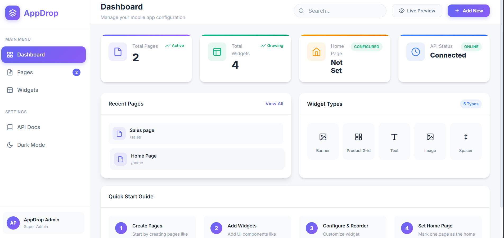
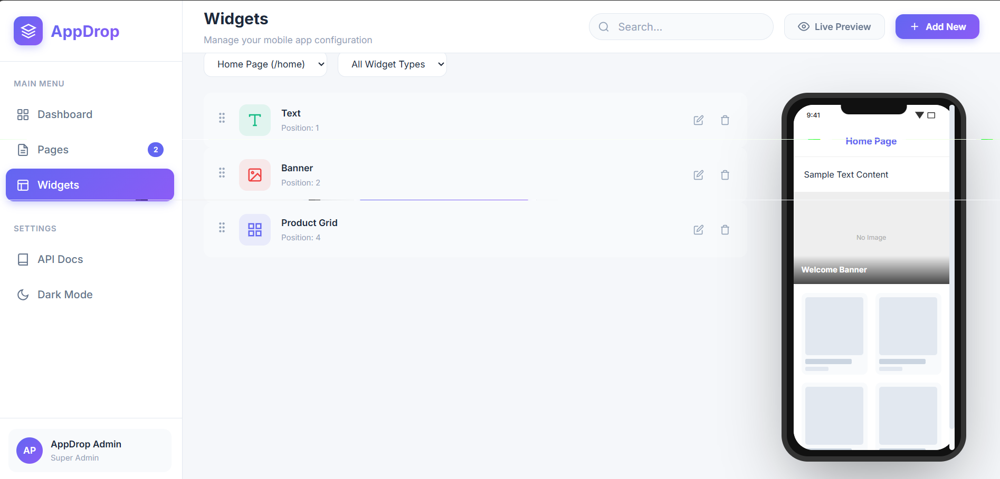

# AppDrop - Mini App Config Dashboard

AppDrop is a No-Code tool designed to help merchants build and manage mobile app layouts through a simple, intuitive dashboard. 

## The Architecture

The project is split into two main parts:
1.  **Backend (`/backend`)**: A robust REST API built with **Go** and **PostgreSQL**. It handles all the data logic, reordering validation, and storage using flexible JSON configurations.
2.  **Frontend (`/frontend`)**: A modern, responsive **Live Dashboard** built with vanilla HTML, CSS, and JavaScript. No heavy frameworks—just pure speed and performance.

## 📸 Visual Overview

<div align="center">
  <table style="width:100%; border:none;">
    <tr>
      <td align="center" style="border:none;">
        <strong> Dashboard View</strong><br>
        
      </td>
      <td align="center" style="border:none;">
        <strong> Widget Visualization</strong><br>
        
      </td>
    </tr>
  </table>
  <p><i>Building modern mobile layouts with a focus on simplicity and performance.</i></p>
</div>

---

## Getting Started

### 1. The Backend (API)
The backend is the brain of the app. It stores your pages and widgets.
*   **Setup**: Follow the detailed guide in `backend/README.md`.
*   **Run**: 
    ```bash
    cd backend
    go run main.go
    ```
*   **Port**: The API runs on `http://localhost:8080`.

### 2. The Frontend (Dashboard)
The frontend is the visual editor for your app.
*   **Run**: Open `frontend/index.html` in your browser, or serve it using:
    ```bash
    cd frontend
    python -m http.server 3000
    ```
*   **Port**: The dashboard runs on `http://localhost:3000`.

---

## Key Features

*   **Live Mobile Preview**: See your app design update in real-time as you add widgets on a virtual phone screen.
*   **Drag & Drop**: Reorder your app components visually; the backend updates the database instantly.
*   **Dark Mode**: A premium, sleek interface designed for modern editors.
*   **Bonus Backend Tools**: Includes pagination, widget type filtering, and sub-millisecond query performance.

---

*For detailed API documentation and curl commands, please check the [Backend README](./backend/README.md).*
